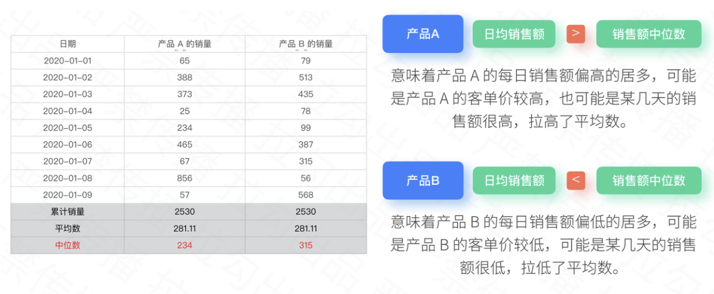

# 一、 描述性统计

## 1.1 定义
> 通过几个简单的分析方法就能在几秒钟内提取出指标背后的数据特征。快速建立整体的认知，并帮助我们找到分析的突破口。

## 1.2 方法及工具
* 3个分析方法：  
  (1) 中位数/平均值  
  (2) 方差/标准差  
  (3) 分位数/异常值
   
* 2个分析工具：  
  (1) 箱线图  
  (2) 数据分析工具箱

### 1.2.1 中位数与平均数
&Rightarrow; 中位数和平均数通常结合起来使用，用于判断数据分布偏大还是偏小的情况。

### 1.2.2 方差和标准差
&Rightarrow; 方差和标准差代表着数据的离散程度，用于表示业务指标的波动情况。当方差和标准差变大的时候，意味着指标波动大，业务风险高。当方差和标准差变小的时候，意味着指标波动小，业务风险低。

从上图的数据中看出，渠道b的标准差和方差数值最大也就意味着波动最多，渠道或客不稳定，需要持续关注。成功率标准差相较于上周的数值翻了一番，说明登录成功率波动较大。需要重点排查产品端和接口端的系统稳定性。打开人数标准差相较于上周下降了一倍，说明用户流量比之前稳定。

