# 数据分析方法
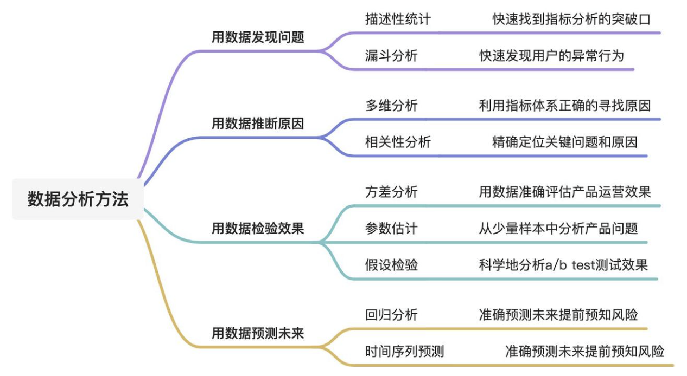

# 一、 描述性统计
## 1.1 定义
> 通过几个简单的分析方法就能在几秒钟内提取出指标背后的数据特征。快速建立整体的认知，并帮助我们找到分析的突破口。

## 1.2 方法及工具
* 3个分析方法：  
  (1) 中位数/平均值  
  (2) 方差/标准差  
  (3) 分位数/异常值
   
* 2个分析工具：  
  (1) 箱线图  
  (2) 数据分析工具箱

### 1.2.1 中位数与平均数
中位数和平均数通常结合起来使用，用于判断数据分布偏大还是偏小的情况。
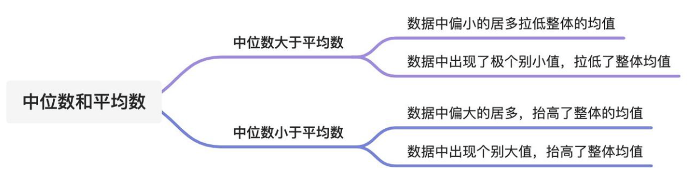

### 1.2.2 方差和标准差
方差和标准差代表着数据的离散程度，用于表示业务指标的波动情况。当方差和标准差变大的时候，意味着指标波动大，业务风险高。当方差和标准差变小的时候，意味着指标波动小，业务风险低。
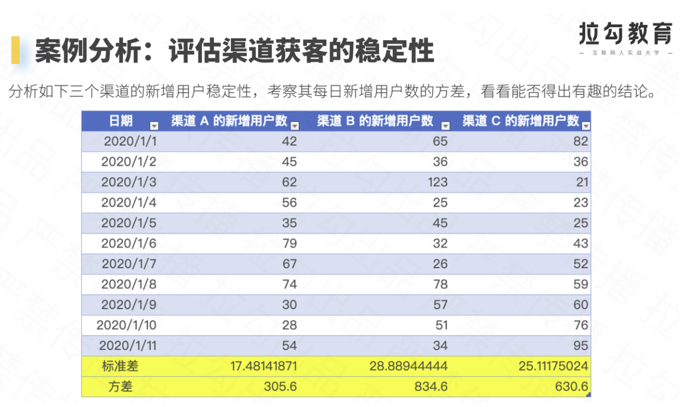
&Rightarrow; 从上图的数据中看出，渠道b的标准差和方差数值最大也就意味着波动最多，渠道或客不稳定，需要持续关注。成功率标准差相较于上周的数值翻了一番，说明登录成功率波动较大。需要重点排查产品端和接口端的系统稳定性。打开人数标准差相较于上周下降了一倍，说明用户流量比之前稳定。

### 1.2.3 异常值
异常值，即在数据集中存在过高和过低的值。异常值不一定是最大值和最小值，可能连续几个过高或者过低的值。需要通过分位数计算得到，正常上限值和正常下限值，超出范围即视为异常值。
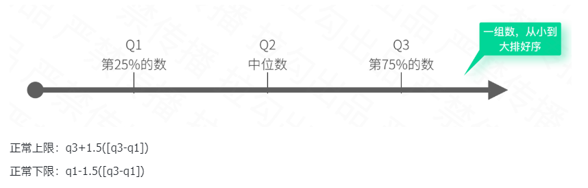
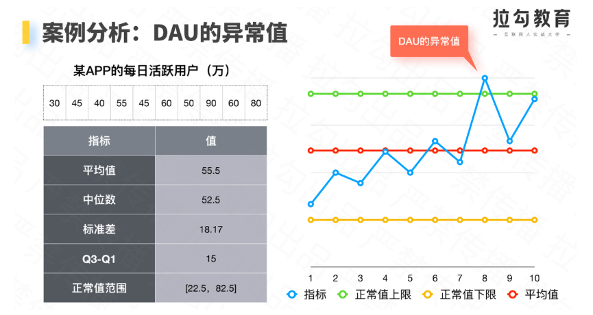

### 1.2.4 箱线图
箱线图可以直观地看出， 平均数、中位数、方差/标准差、异常值
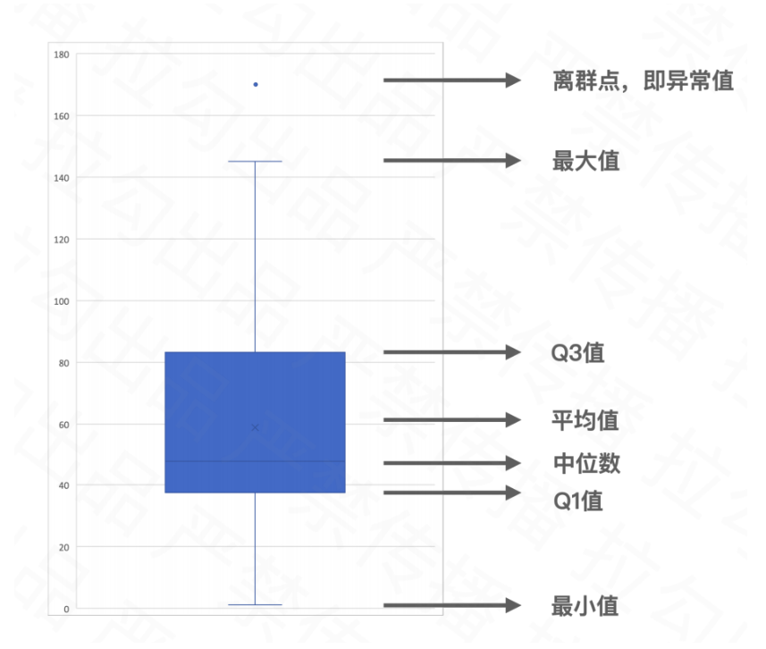

### 1.2.5 数据分析工具包
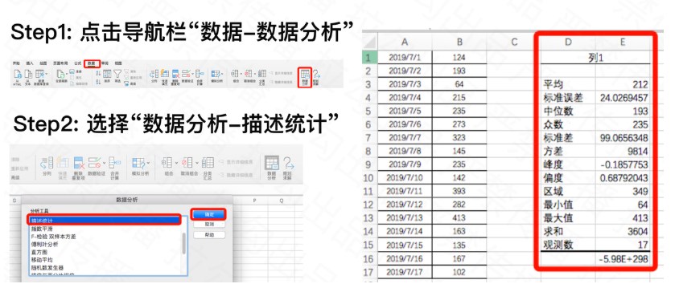

### 1.2.6 描述性统计案例
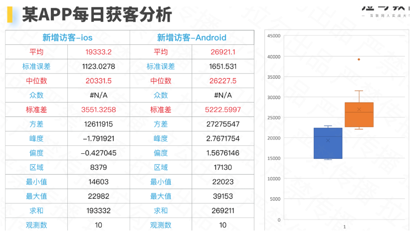  
&Rightarrow; 业务解读：蓝色的箱子比橘色的箱子底，证明ios获客能力比安卓低。蓝色箱子中x比横线低，即代表着均值小于中位数，意味着大部分每日获客偏低或者某几天特别低。橘色箱子中x比横线高，即代表均值高于中位数，意味着每日获客偏高或者某几天特别高。特别的橘色箱子中有一个黄色点大于正常上限值（需要单独分析原因）。

### 1.2.7 描述性统计可以解决哪些问题
(1) 今天的dau比昨天跌了5%，您会如何分析：应用正常值上限和下限，判断下跌5%是属于正常波动还是异常波动  
(2) 今天的dau是近一个月的峰值，您会如何分析：应用正常值上限和下限，判断峰值是属于正常波动还是异常波动  
(3) 9月和10月的日均dau完全一样，您会如何分析：根据分析目的，如日均dau数据分布情况需要比较中位数和平均数的大小情况，如果是活跃稳定性情况需要计算方差和标准差  

# 二、 漏斗分析（分析用户的异常行为）
## 2.1 定义
> 漏斗分析主要用于一系列连续步骤的转化和流失情况。
>> ***即在同一个业务中，对每个存在直接联系的步骤进行流经情况分析***
>> * 漏斗分析的底层逻辑，万事万物皆可流程
>> * 漏斗分析的价值即为流程的数据化

## 2.2 分析三要素
漏斗分析的三要素是分析周期、埋点页面/事件、埋点页面流量/埋点事件流量
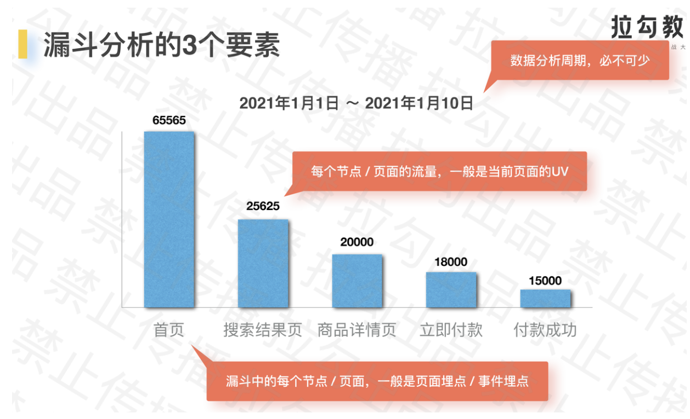

## 2.3 常见的漏斗分析功能
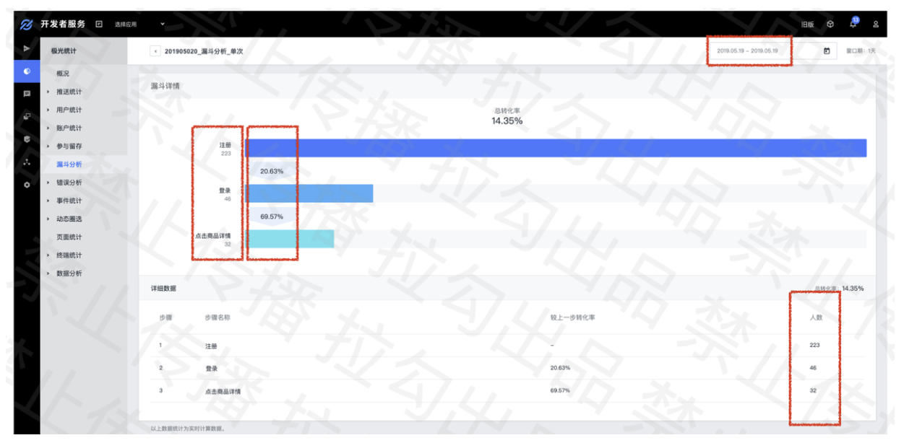

## 2.4 分析应用步骤
明确进入漏斗的客群 ——> 分析整个漏斗的转化 ——> 分析每个步骤的停留时长 ——> 分析每个步骤的转化率
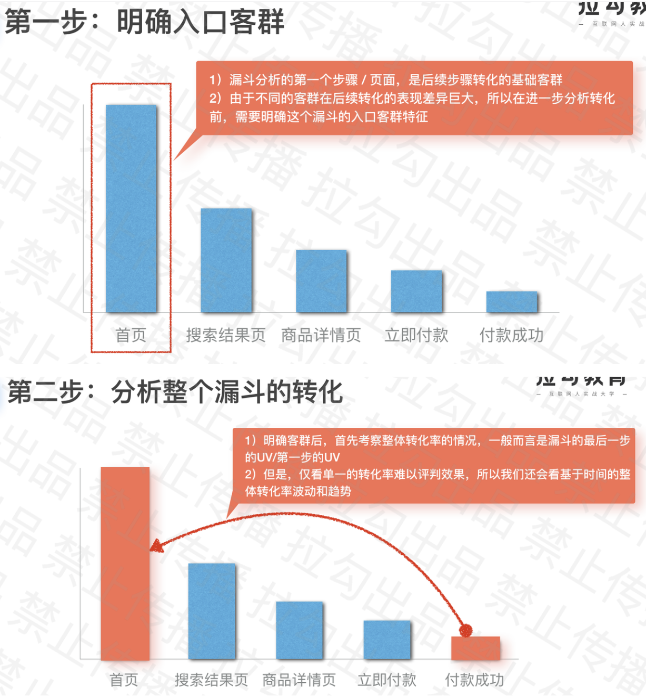
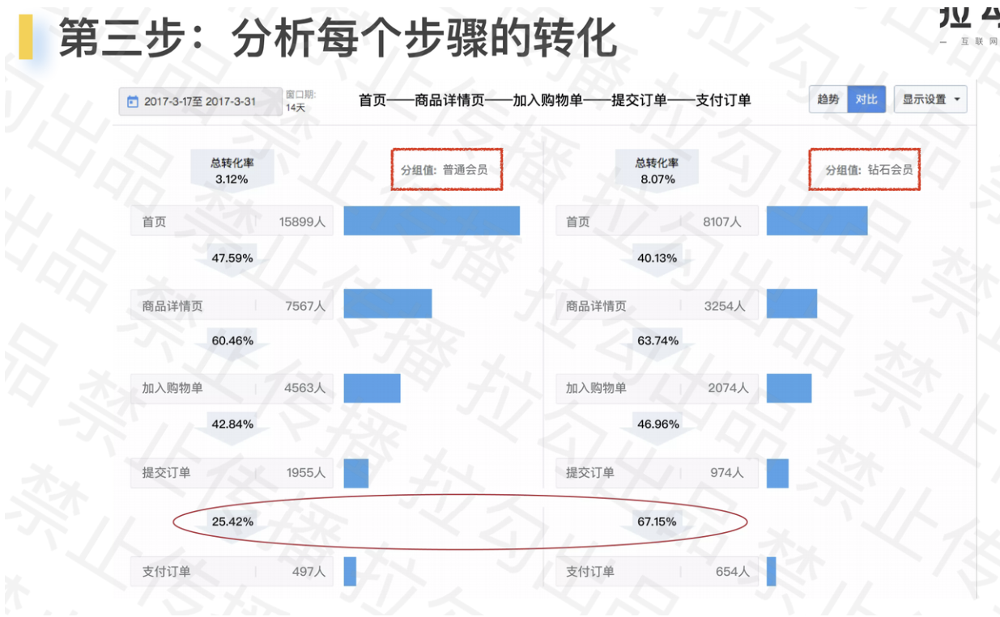
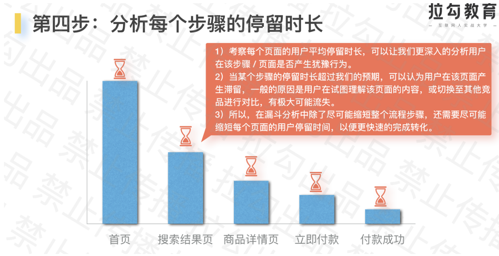

## 2.5 漏斗分析案例
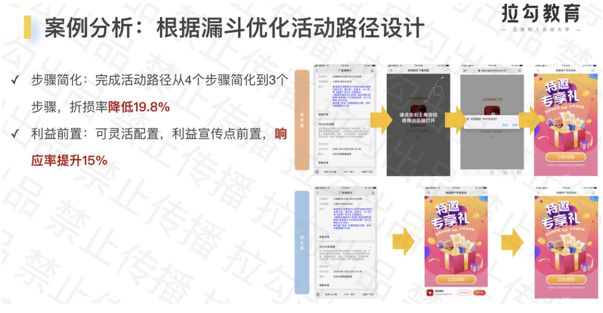
***&Rightarrow; 漏斗模型的原则：尽可能减少节点，降低流失率***

## 2.6 漏斗分析可以解决哪些问题
(1) 应该怎么优化新用户注册流程：根据漏斗模型，首先关注分析新用户的画像，然后评估过去一段时间整体的注册转化率、每个节点转化率的波动情况。根据注册转化率数值大小和波动情况，深入分析节点的停留时长，流失率的原因 (ex. 改进UI、UX设计)  
(2) 如何分析用户使用积分过程：根据漏斗模型，首先关注分析用户的画像，然后评估某段时间内积分流程整体转化率和各节点转化率，深入分析流失率高的节点，寻找原因改善设计  
